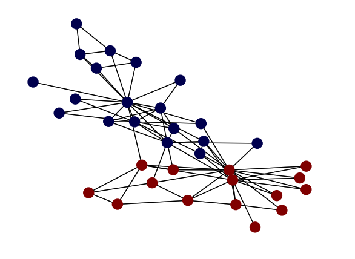

<!-- ABOUT THE PROJECT -->
## About The Project

In this project we have implemented and evaluate three community detection algorithms.

* Louvain Algorithm
* Label Propagation Algorithm
* Girvan-Newman Algorithm

Students:
* Andreas Panayiotou
* Theodoros Kyriakou

### Prerequisites

Below are shown the necessary python libraries to run the algorithms. 
* NetworkX
  ```sh
  pip install networkx
  ```
* Matplotlib
  ```sh
  pip install matplotlib
  ```
* NumPy (Only for Louvain)
  ```sh
  pip install numpy
  ```
* scikit-learn (Used for evaluation measures)
  ```sh
  pip install scikit-learn
  ```
  
<!-- USAGE EXAMPLES -->
## Usage

* Louvain Algorithm
  *  You can change randomBool global variable to True for random visit sequence and set a random seed.
  ```sh
  python Louvain.py
  ```
* Label Propagation Algorithm
  *  You can set the number of maximum iterations in ITERATIONS global variable.
  ```sh
  python LabelPropagation.py
  ```
* Girvan Newman Algorithm
  *  You can set the value of centralityValue global variable. This value is used in the calculation of betweenness centrality. If its None use all nodes of the network. In case of large network you can set a number of nodes k (where k <= number of nodes) to find an approximation of betweenness centrality.
  ```sh
  python GirvanNewman.py
  ```
## Outputs

In this section you cna see the output of each algorithm on Zachary's karate club Network.

<h4>Louvain Algorithm</h4>
  
  

<h4>Label Propagation Algorithm</h4>
  
  

<h4>Girvan Newman Algorithm</h4>
  
  
